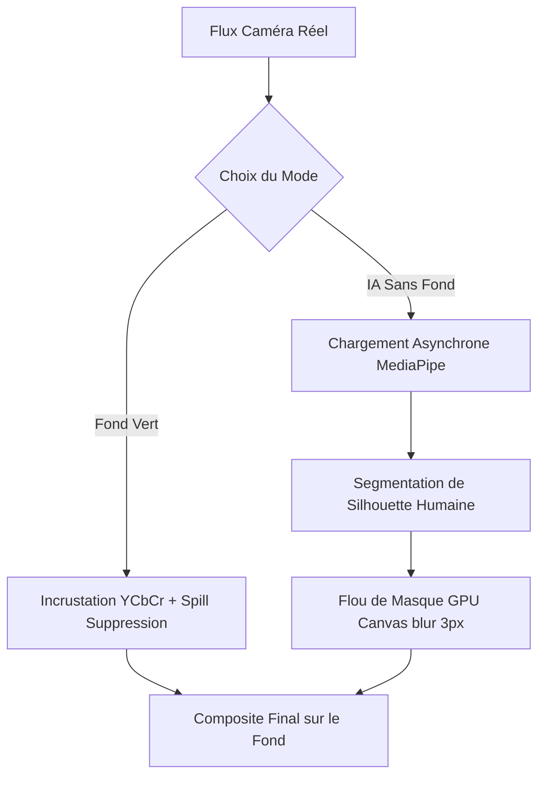

# Processus de Création : Green Screen Photobooth App

Ce document retrace l'intégralité des étapes, des choix technologiques et des équations mathématiques mis en œuvre pour concevoir cette application professionnelle de photobooth sur tablette.

---

## 1. Stack Technique et Initialisation
L'objectif était de bâtir une application web moderne (Single Page Application), fluide (60 FPS constants), esthétique et optimisée pour un usage sur tablette tactile.

* **Outil de Build & Environnement** : [Vite](https://vite.dev) avec le template `React + TypeScript` pour un Hot Module Replacement (HMR) instantané et un typage statique robuste.
* **Navigation** : Intégration de `react-router-dom` pour séparer proprement l'écran d'accueil interactif de l'interface de prise de vue principale.
* **Système de Design** : [Tailwind CSS](https://tailwindcss.com) couplé à des composants personnalisés inspirés de [shadcn/ui] (boutons transparents, cartes avec flou d'arrière-plan, barres de défilement stylisées).
* **Icônes** : `lucide-react` pour une interface moderne et épurée.
* **Accès Caméra** : `react-webcam` pour simplifier la gestion des flux de capture utilisateur.

---

## 2. Charte Graphique, Typographie et Ressources
Pour offrir une expérience visuelle captivante dès le premier regard, l'application adopte une esthétique sombre et luxueuse :

* **Typographie Personnalisée** : Intégration globale de la police de caractères **Prociono** (`prociono.ttf`) chargée via CSS `@font-face` et configurée comme police par défaut dans Tailwind, conférant un aspect élégant et premium à l'ensemble du projet.
* **Fonds Générés par IA** : Création de 4 paysages immersifs en haute définition (format horizontal 16:9) stockés localement dans `/public/backgrounds/` :
  1. *Cyberpunk City* : Un panorama nocturne illuminé par des néons vibrants.
  2. *Tropical Beach* : Une plage paradisiaque lumineuse et ensoleillée.
  3. *Magical Forest* : Une forêt enchantée fantastique et mystérieuse.
  4. *Space Station* : Une baie vitrée ouvrant sur un panorama spatial de science-fiction.

---

## 3. Algorithme Chroma Key de Qualité Broadcast (Espace YCbCr)
Les algorithmes d'incrustation basiques calculent la distance de couleur en espace RVB (Rouge, Vert, Bleu), ce qui les rend extrêmement sensibles aux ombres, aux plis du tissu et aux variations de luminosité. 

Pour éliminer ce problème, nous avons implémenté un algorithme de niveau professionnel en espace **YCbCr** :

### A. Séparation Luminance / Chrominance
Chaque pixel de la caméra est converti à la volée de l'espace RGB vers l'espace YCbCr (norme BT.601) :
$$Y = 0.299R + 0.587G + 0.114B$$
$$Cb = -0.1687R - 0.3313G + 0.5B + 128$$
$$Cr = 0.5R - 0.4187G - 0.0813B + 128$$

* La **Luminance ($Y$)** représente la luminosité. Elle est totalement ignorée dans notre calcul de distance.
* Les composantes de **Chrominance ($Cb, Cr$)** portent l'information de couleur pure.

La distance géométrique est calculée exclusivement dans le plan 2D $(Cb, Cr)$ :
$$Distance = \sqrt{(Cb - Cb_{key})^2 + (Cr - Cr_{key})^2}$$

Grâce à cette formule, **les ombres portées et les variations de lumière sur le fond vert n'altèrent plus du tout la qualité du détourage**.

### B. Adoucissement des Bordures (Soft-Feathering)
Au lieu d'un détourage binaire (pixel transparent ou opaque), nous appliquons une transition d'opacité progressive (interpolation linéaire douce) sur une zone de transition ($smoothness = 15$) :

```typescript
const alpha = Math.max(0, Math.min(1, (distance - tolerance) / smoothness));
```
Les cheveux, les vêtements fins et les contours flous bénéficient ainsi d'une transparence progressive, offrant des bords parfaitement lisses.

### C. Suppression Dynamique du Spill (Anti-Halo Vert)
Pour éliminer les reflets verts (spill) qui rebondissent sur la peau et les vêtements des sujets, l'algorithme détecte la couleur dominante du fond vert et atténue dynamiquement cette composante sur les pixels proches de la bordure en la ramenant vers la moyenne des deux autres canaux.

---

## 4. Mode Miroir et Alignement de la Pipette
Pour que l'expérience utilisateur soit naturelle, la caméra fonctionne en **mode miroir** :
1. **Preview Canvas** : Le flux vidéo est dessiné horizontalement inversé sur le canvas de sortie en appliquant les transformations :
   ```typescript
   sourceCtx.translate(width, 0);
   sourceCtx.scale(-1, 1);
   ```
2. **Pipette de Sélection** : Comme le retour visuel est inversé mais que les clics tactiles de l'utilisateur sont relatifs aux coordonnées de l'écran, les coordonnées de sélection de la couleur du fond vert sont projetées mathématiquement pour correspondre au pixel exact du capteur de la caméra.

---

## 5. Moteur Hybride IA : Détourage sans Fond (MediaPipe)
Pour les événements où les invités portent des vêtements verts ou lorsqu'aucun fond physique n'est disponible, nous avons développé un **moteur hybride IA** commutable à la volée.



* **Chargement Asynchrone & CDN** : Pour ne pas surcharger le bundle initial de l'application et éviter les conflits de compilation avec Vite, la bibliothèque `@mediapipe/selfie_segmentation` est injectée dynamiquement à la volée uniquement si l'utilisateur active le mode IA. Un écran de chargement de style "verre dépoli" (glassmorphic) informe l'utilisateur du chargement du modèle.
* **Adoucissement des Bords IA (Feathering)** : Les modèles d'IA web effectuent la segmentation sur des textures de basse résolution (ex: 256x256), générant des bordures pixelisées. Pour y remédier, nous appliquons un filtre de flou gaussien accéléré matériellement sur le masque avant la découpe :
  ```typescript
  sourceCtx.filter = "blur(3px)";
  ```
  Cela donne une silhouette détourée extrêmement douce qui s'intègre harmonieusement à l'arrière-plan.
* **Multi-personnes** : Le modèle de MediaPipe segmente parfaitement toutes les silhouettes humaines présentes dans le cadre simultanément.

---

## 6. Sécurisation et Panneau d'Administration
Destiné à un usage en événement public, le Photobooth intègre un espace d'administration sécurisé pour ajuster les paramètres de l'appareil :

* **Verrouillage par Mot de Passe** : Un bouton discret d'engrenage permet d'ouvrir l'accès aux réglages. La saisie d'un mot de passe (persistant et configurable, par défaut `"toto"`) est requise pour déverrouiller le panneau.
* **Panneau d'Administration Intuitif** :
  * **Sélecteur de Mode** : Permet de basculer instantanément entre **Fond Vert** (Chroma Key classique) et **IA (Sans Fond)**.
  * **Ajustement Contextuel** : Si le mode IA est sélectionné, l'outil pipette et le réglage de sensibilité se désactivent automatiquement pour laisser place à une bannière informative indiquant que les ajustements sont gérés automatiquement.
  * **Persistance Locale** : Tous les réglages d'administration (mot de passe, sensibilité, couleur clé sélectionnée, mode de détourage actif) sont persistés de manière transparente dans le navigateur grâce à `localStorage`.

---

## 7. Architecture Modulaire React (Clean Architecture)
Afin de maintenir une base de code lisible, modulaire et hautement performante, l'orchestration de l'application a été structurée en hooks personnalisés isolant la logique de l'affichage :

1. **`useBackgrounds.ts`** : Gère la liste des arrière-plans, le préchargement asynchrone des images (`new Image()`) et l'état de l'image sélectionnée.
2. **`usePhotobooth.ts`** : Gère le déclenchement de la pose, le décompte visuel de 5 secondes, et l'export du canvas final sous forme d'URL de données (`image/png`).
3. **`useChromaKeyRender.ts`** : Le cœur de calcul qui pilote la boucle de rendu principale à l'aide de `requestAnimationFrame`. Il gère le chargement dynamique du script IA, l'exécution synchronisée des deux moteurs de rendu et le nettoyage complet des ressources mémoire lors du démontage des composants.
4. **`useLocalStorage.ts`** : Synchronise automatiquement les états React avec le stockage local du navigateur.
5. **`useInactivityTimeout.ts`** : Redirige automatiquement l'application vers la page d'accueil après un délai d'inactivité de 60 secondes sans interaction, idéal pour réinitialiser la borne entre deux groupes d'utilisateurs.
